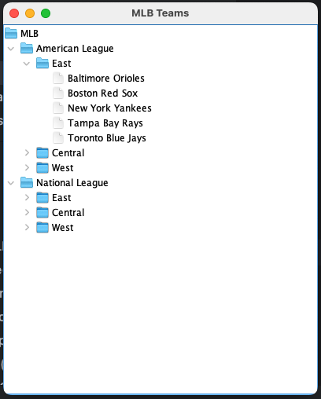

# 114-2_FCU_Framework-Design_H03

### 16.6.3 MLB 棒球大聯盟

用 Composite 設計模式實作 MLB 聯盟與球隊結構。

請設計一套類別架構，使用 **Composite 設計樣式**，能表示 **聯盟 (League)、分區 (Division)、球隊 (Team)** 三層結構，並使用 `JTree` 顯示出 MLB 完整資料。  

1. 設計一個共同的抽象類別或介面，例如 `MLBComponent`，並定義基本操作如 `add()`、`remove()`、`getChild()`、`getName()`。
2. `League`、`Division` 必須能夠包含其他 `MLBComponent`（Composite 角色）。其結構如圖一。
3. `Team` 只代表個別球隊（Leaf 角色），不能再新增子節點。
4. 使用 `JTree` 把整個 MLB 結構視覺化。樣子如下圖。
5. 延伸題：點選球隊節點時，能顯示所屬聯盟與分區資訊。

圖一：MLB 的樹狀結構
```
MLB
 ├── American League
 │    ├── East
 │    │    ├── Baltimore Orioles
 │    │    ├── Boston Red Sox
 │    │    └── ...
 │    └── Central
 │         └── ...
 └── National League
      └── East
           └── ...
```

圖二：使用 JTree 來做視窗化呈現：
